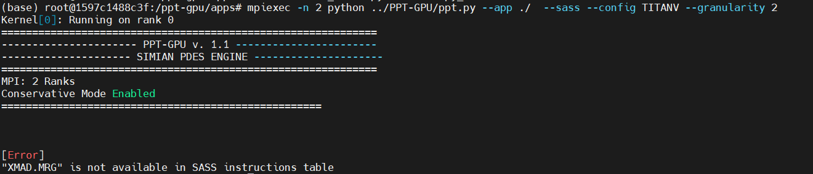

# Set up environments for PPT-GPU (SC'21)

## Configure Git
```bash
git config --global user.name "elio"
git config --global user.email "2925539854@qq.com"
ssh-keygen -t rsa -C "2925539854@qq.com"
```

## Basic Dependencies

Get ``glib2.0`` using

```bash
sudo apt-get update -y
sudo apt-get install libglib2.0-dev
```

if error like this :

```bash
libglib2.0-dev : Depends: libglib2.0-0 (= 2.33.12+really2.32.4-5) but 2.42.1-1 is to be installed
			    Depends: libglib2.0-bin (= 2.33.12+really2.32.4-5) but 2.42.1-1 is to be installed
```

then install corresponding dependencies:

```bash
apt-get install libglib2.0-0=2.33.12+really2.32.4-5
apt-get install libglib2.0-bin= 2.33.12+really2.32.4-5
```

``gfortran`` is used for building  ``mpich`` and ``ninja`` is used for building``llvm``

```
apt-get install gfortran
apt-get install ninja-build
apt-get install re2c
```
 also, make sure the ``nvcc -V`` output the ``CUDA version >=10.1``. As for the driver version:``<= 450.36``. In my case, I am using a ``Geforce GTX 1080 Ti`` card :


## mpich

Get the ``mpich`` package from the website(http://www.mpich.org/downloads/), then build and install it.

```bash
cd mpich_src_dir
./configure -prefix=/opt/mpich
make && make install 
```

 Add into the ``PATH``, add these lines to ``~/.bashrc``

``` 
export MPI_ROOT=/opt/mpich
export PATH=$MPI_ROOT/bin:$PATH
export MANPATH=$MPI_ROOT/man:$MANPATH
```

Always source the file after adjusting:

```bash
source ~/.bashrc
```

Then update the correct ``libmpich. so`` path in the ``simian.py``, if you install ``mpich`` to ``/opt/mpich``, no changes are needed.

## Trace Tool

  Setup ``ARCH`` variable in the Makefile, then 

```bash
make clean && make
```

 You can use this trace tool in this way:

```bash
LD_PRELOAD=/ppt-gpu/PPT-GPU/tracing_tool/tracer.so  ./app.out
```

for example in my ``apps`` directory:


compile the program using ``nvcc`` as normal (for **SASS**):

```bash
nvcc -arch=sm_60 saxpy.cu -o saxpy
```

then :

```bash
LD_PRELOAD=/ppt-gpu/PPT-GPU/tracing_tool/tracer.so  ./saxpy
```

The results look like this:


## LLVM Tool

Make sure to get ``llvm`` from the git repository by:

```bash
git clone --branch release/11.x https://github.com/llvm/llvm-project.git
```

**DO NOT USE THE PRE-BUILD LLVM VERSION**

Start building the ``llvm``, into the ``llvm`` main directory, then:

```bash
mkdir build && cd build
cmake  -DLLVM_ENABLE_PROJECTS=clang \
-DCMAKE_INSTALL_PREFIX=/opt/llvm-11.0 \
-DCMAKE_BUILD_TYPE=Release  \
-DLLVM_ENABLE_ASSERTIONS=ON \
-DLLVM_ENABLE_DOXYGEN=OFF -DLLVM_BUILD_DOCS=OFF \
-GNinja \
-DLLVM_INSTALL_BINUTILS_SYMLINKS=ON -DBUILD_SHARED_LIBS=ON \
../llvm
```

If everything is OK, use ``ninja`` by simply typing :

```bash
ninja
```

This step might be crashed due to a compiler error, that's OK, when an error occurs, type ``ninja`` again.

``PPT-GPU llvm_tool`` is **NOT** the same as``cuda_flux`` so copy some files from the original ``cuda_flux``  from https://github.com/UniHD-CEG/cuda-flux.git.

```bash
cp  cuda_flux/CMakeLists.txt  PPT-GPU/llvm_tool
cp  cuda_flux/mekong-utils/CMakeLists.txt PPT-GPU/llvm_tool/mekong-utils/
```

Before build, configure the toolchain :

```
export CC=/opt/llvm-11.0/bin/clang
export CXX=/opt/llvm-11.0/bin/clang++
export C_INCLUDE_PATH=/usr/local/cuda/include:/opt/llvm-11.0/include
export CPLUS_INCLUDE_PATH=/usr/local/cuda/include:/opt/llvm-11.0/include
export CUDA_PATH=/usr/local/cuda
export LD_LIBRARY_PATH=/usr/local/cuda/lib64:/opt/llvm-11.0/lib
export LIBRARY_PATH=/usr/local/cuda-10.1/lib64:/opt/llvm-11.0/lib
export LLVM_DIR=/opt/llvm-11.0/lib/cmake/llvm
```

Then make and install :

```bash
cmake -DCMAKE_INSTALL_PREFIX=/opt/cuda-flux ..
make && make install 
```

Add into the ``PATH``, add these lines to ``~/.bashrc``:

```bash
export PATH=$PATH:/opt/cuda-flux/bin
```

In case of the link error :

```
ln -s /usr/local/cuda/lib64/libcudart.so /usr/lib/libcudart.so
```

And now return to the application directory and using this clang to compile (for **PTX**):

```bash
clang_cf++ -O3 --cuda-gpu-arch=sm_60 -std=c++11 -lcudart saxpy.cu -o saxpy
```

The results look like this:


Now run the application:


You can see there are directories and files including ``app_config.py``,``memory_traces/``,`` ptx_traces/``,`` sass_traces/`` as the paper described. 

## Reuse Distance Tool

Simply by following these commands:

```bash
cd reuse_distance_tool
make
```

## PPT-GPU

Using the tool by these commands( in the ``PPT-GPU`` directory ):

1. from **SASS**

**NOTICE**: All programs should be compiled through **nvcc**

After compilation, run the application as usual. Then you have ``app_config.py``,``memory_traces/,`` and `` sass_traces/`` in the application directory, now, go to the ``PPT-GPU`` directory and execute :

```bash
mpiexec -n 2 python ppt.py --app dir_of_app/ --sass --config TITANV --granularity 2 
```

There is an error like this:



So you have to add the corresponding instruction latency to the corresponding SASS instruction table in ``PPT-GPU/hardware/ISA``.

2. from **PTX**

**NOTICE**: All programs should be compiled through **llvm** and **clang++** compiler first.

After compilation, first, run the program and then generate ``memory_trace`` using ``trace_tool``:

```
LD_PRELOAD=/ppt-gpu/PPT-GPU/tracing_tool/tracer.so  ./app.out
```

After you have ``app_config.py``,``memory_traces/``,`` ptx_traces/``,`` sass_traces/`` in application directory, go to ``PPT-GPU`` directory and execute :

```bash
mpiexec -n 1 python ppt.py --app dir_of_app/ --ptx --config TITANV --granularity 2 --kernel 1
```

## Example

Here is the ``bfs`` from ``Rodinia Benchmark``, use ``PPT-GPU`` in this program as below.

The directory is formed in this way:

```bash
root@1597c1488c3f:/ppt-gpu/bfs# ls
bfs.cu  graph4096.txt  kernel2.cu  kernel.cu  Makefile  run
```

Firstly, compile ``bfs`` using ``clang_cf++``:

```makefile
root@1597c1488c3f:/ppt-gpu/bfs# cat Makefile

CC := clang_cf++
INCLUDE := $(CUDA_DIR)/include
SRC = bfs.cu
EXE = bfs
release: $(SRC)
         $(CC) -O3 -std=c++11 --cuda-gpu-arch=sm_60 $(SRC) -o $(EXE) -I$(INCLUDE) -L/usr/local/lib -lcudart
clean: $(SRC)
        rm -f $(EXE) $(EXE).linkinfo result.txt  *.bc *.out *.ptx
```

the output of ``make`` looks like:

```bash
root@1597c1488c3f:/ppt-gpu/bfs# make

clang_cf++ -O3 -std=c++11 --cuda-gpu-arch=sm_60 bfs.cu  -o bfs -I/include -L/usr/local/lib -lcudart
+ clang++ -Xclang -load -Xclang /opt/cuda-flux/lib/libcuda_flux_pass.so -finline-functions -O3 -std=c++11 --cuda-gpu-arch=sm_60 bfs.cu -o bfs -I/include -L/usr/local/lib -lcudart
clang-11: warning: Unknown CUDA version. cuda.h: CUDA_VERSION=11000. Assuming the latest supported version 10.1 [-Wunknown-cuda-version]
CUDA Flux: Instrumenting device code...
CUDA Flux: Module prefix: bfs.cu_5d02b493
clang version 11.1.0 (https://github.com/llvm/llvm-project.git 1fdec59bffc11ae37eb51a1b9869f0696bfd5312)
Target: x86_64-unknown-linux-gnu
Thread model: posix
InstalledDir: /opt/llvm-11.0/bin
Found candidate GCC installation: /usr/lib/gcc/x86_64-linux-gnu/7
Found candidate GCC installation: /usr/lib/gcc/x86_64-linux-gnu/7.5.0
Found candidate GCC installation: /usr/lib/gcc/x86_64-linux-gnu/8
Selected GCC installation: /usr/lib/gcc/x86_64-linux-gnu/7.5.0
Candidate multilib: .;@m64
Selected multilib: .;@m64
Found CUDA installation: /usr/local/cuda-11.0, version 11.0
clang-11: warning: Unknown CUDA version. cuda.h: CUDA_VERSION=11000. Assuming the latest supported version 10.1 [-Wunknown-cuda-version]
 (in-process)
 "/opt/llvm-11.0/bin/clang-11" -cc1 -triple nvptx64-nvidia-cuda -aux-triple x86_64-unknown-linux-gnu -emit-llvm -disable-free -main-file-name cuda_flux_drt1Qbsdb.cu -mrelocation-model static -mframe-pointer=all -fno-rounding-math -fno-verbose-asm -no-integrated-as -aux-target-cpu x86-64 -fcuda-is-device -mlink-builtin-bitcode /usr/local/cuda-11.0/nvvm/libdevice/libdevice.10.bc -target-feature +ptx70 -target-sdk-version=11.0 -target-cpu sm_60 -fno-split-dwarf-inlining -debugger-tuning=gdb -v -resource-dir /opt/llvm-11.0/lib/clang/11.1.0 -internal-isystem /opt/llvm-11.0/lib/clang/11.1.0/include/cuda_wrappers -internal-isystem /usr/local/cuda-11.0/include -include __clang_cuda_runtime_wrapper.h -c-isystem /usr/local/cuda/include -c-isystem /opt/llvm-11.0/include -c-isystem /usr/local/include -c-isystem /usr/include -cxx-isystem /usr/local/cuda/include -cxx-isystem /opt/llvm-11.0/include -internal-isystem /usr/lib/gcc/x86_64-linux-gnu/7.5.0/../../../../include/c++/7.5.0 -internal-isystem /usr/lib/gcc/x86_64-linux-gnu/7.5.0/../../../../include/x86_64-linux-gnu/c++/7.5.0 -internal-isystem /usr/lib/gcc/x86_64-linux-gnu/7.5.0/../../../../include/x86_64-linux-gnu/c++/7.5.0 -internal-isystem /usr/lib/gcc/x86_64-linux-gnu/7.5.0/../../../../include/c++/7.5.0/backward -internal-isystem /usr/lib/gcc/x86_64-linux-gnu/7.5.0/../../../../include/c++/7.5.0 -internal-isystem /usr/lib/gcc/x86_64-linux-gnu/7.5.0/../../../../include/x86_64-linux-gnu/c++/7.5.0 -internal-isystem /usr/lib/gcc/x86_64-linux-gnu/7.5.0/../../../../include/x86_64-linux-gnu/c++/7.5.0 -internal-isystem /usr/lib/gcc/x86_64-linux-gnu/7.5.0/../../../../include/c++/7.5.0/backward -internal-isystem /usr/local/include -internal-isystem /opt/llvm-11.0/lib/clang/11.1.0/include -internal-externc-isystem /usr/include/x86_64-linux-gnu -internal-externc-isystem /include -internal-externc-isystem /usr/include -internal-isystem /usr/local/include -internal-isystem /opt/llvm-11.0/lib/clang/11.1.0/include -internal-externc-isystem /usr/include/x86_64-linux-gnu -internal-externc-isystem /include -internal-externc-isystem /usr/include -O3 -std=c++11 -fdeprecated-macro -fno-dwarf-directory-asm -fno-autolink -fdebug-compilation-dir /ppt-gpu/bfs -ferror-limit 19 -fgnuc-version=4.2.1 -fcxx-exceptions -fexceptions -fcolor-diagnostics -vectorize-loops -vectorize-slp -o /tmp/cuda_flux_drt1Qbsdb.ll -x cuda /tmp/cuda_flux_drt1Qbsdb.cu
clang -cc1 version 11.1.0 based upon LLVM 11.1.0 default target x86_64-unknown-linux-gnu
ignoring nonexistent directory "/include"
ignoring nonexistent directory "/include"
ignoring duplicate directory "/usr/local/cuda/include"
ignoring duplicate directory "/usr/lib/gcc/x86_64-linux-gnu/7.5.0/../../../../include/x86_64-linux-gnu/c++/7.5.0"
ignoring duplicate directory "/usr/lib/gcc/x86_64-linux-gnu/7.5.0/../../../../include/c++/7.5.0"
ignoring duplicate directory "/usr/lib/gcc/x86_64-linux-gnu/7.5.0/../../../../include/x86_64-linux-gnu/c++/7.5.0"
ignoring duplicate directory "/usr/lib/gcc/x86_64-linux-gnu/7.5.0/../../../../include/x86_64-linux-gnu/c++/7.5.0"
ignoring duplicate directory "/usr/lib/gcc/x86_64-linux-gnu/7.5.0/../../../../include/c++/7.5.0/backward"
ignoring duplicate directory "/usr/local/include"
ignoring duplicate directory "/opt/llvm-11.0/lib/clang/11.1.0/include"
ignoring duplicate directory "/usr/include/x86_64-linux-gnu"
ignoring duplicate directory "/usr/include"
#include "..." search starts here:
#include <...> search starts here:
 /usr/local/cuda/include
 /opt/llvm-11.0/include
 /opt/llvm-11.0/lib/clang/11.1.0/include/cuda_wrappers
 /usr/lib/gcc/x86_64-linux-gnu/7.5.0/../../../../include/c++/7.5.0
 /usr/lib/gcc/x86_64-linux-gnu/7.5.0/../../../../include/x86_64-linux-gnu/c++/7.5.0
 /usr/lib/gcc/x86_64-linux-gnu/7.5.0/../../../../include/c++/7.5.0/backward
 /usr/local/include
 /opt/llvm-11.0/lib/clang/11.1.0/include
 /usr/include/x86_64-linux-gnu
 /usr/include
End of search list.
CUDA Flux: Working on kernel: _Z6KernelP4NodePiPbS2_S2_S1_i
CUDA Flux: BlockCount: 8
CUDA Flux: Working on kernel: _Z7Kernel2PbS_S_S_i
CUDA Flux: BlockCount: 4
CUDA Flux: instrumenting host code...
CUDA Flux: CUDA Version 11.0
passed before launches loop
CUDA Flux: Found BasicBlockCount for kernel _Z7Kernel2PbS_S_S_i: 4
Passed flux trac pointer creation
passed addition of tracPtr to addArgs
Passed cloneLaunchCall
Call creation serializeCountersFu with tracPtr
passed before launches loop
CUDA Flux: Found BasicBlockCount for kernel _Z6KernelP4NodePiPbS2_S2_S1_i: 8
Passed flux trac pointer creation
passed addition of tracPtr to addArgs
Passed cloneLaunchCall
Call creation serializeCountersFu with tracPtr
```

Then run the program, and ``ptx_trace``  will be generated.

```bash

(base) root@1597c1488c3f:/ppt-gpu/bfs# ll
total 428
......
drwxr-xr-x  2 root root   4096 6月   5 14:31 ptx_traces/
......
```

Now run ``trace_tool``:

```
LD_PRELOAD=/ppt-gpu/PPT-GPU/tracing_tool/tracer.so  ./bfs graph4096.txt
```

Then ``app_config.py``,``memory_traces/``,`` sass_traces/``  will be generated:

```
root@1597c1488c3f:/ppt-gpu/bfs# ll
total 452
......
-rw-r--r--  1 root root   3071 6月   5 14:38 app_config.py
drwxr-xr-x  2 root root   4096 6月   5 14:38 memory_traces/
drwxr-xr-x  2 root root   4096 6月   5 14:31 ptx_traces/
drwxr-xr-x  2 root root   4096 6月   5 14:38 sass_traces/
......
```

Now use ``PPT-GPU`` for ``PTX`` analysis, go back to ``PPT-GPU``directory and run:

```
mpiexec -n 1 python ppt.py --app /ppt-gpu/bfs/ --ptx --config TITANV --granularity 2 --kernel 1
```

Back to ``bfs`` directory, there is a file called ``kernel_1_PTX_g2.out``:

```

- Total GPU computations is divided into 2048 thread block(s) running on 80 SM(s)

- Modeled SM-0 running 4 thread block(s):
        * allocated max active thread block(s): 4
        * allocated max active warps per thread block: 16

- Occupancy of SM-0:
        * Thread block Limit SM: 32
        * Thread block limit registers: 5
        * Thread block limit shared memory: 32
        * Thread block limit warps: 4
        * theoretical max active thread block(s): 4
        * theoretical max active warps per SM: 64
        * theoretical occupancy: 100 %
        * achieved active warps per SM: 34.71
        * achieved occupancy: 54.23 %

- Memory Performance:
        * unified L1 cache hit rate: 5.48 %
        * unified L1 cache hit rate for read transactions (global memory accesses): 6.99 %
        * L2 cache hit rate: 24.54 %

        * Global Memory Requests:
                ** GMEM read requests: 1170
                ** GMEM write requests: 136
                ** GMEM total requests: 1306

        * Global Memory Transactions:
                ** GMEM read transactions: 1170
                ** GMEM write transactions: 136
                ** GMEM total transactions: 1306

        * Global Memory Divergence:
                ** number of read transactions per read requests: 1.0 (3.12%)
                ** number of write transactions per write requests: 1.0 (3.12%)

        * L2 Cache Transactions (for global memory accesses):
                ** L2 read transactions: 1088
                ** L2 write transactions: 136
                ** L2 total transactions: 1224

        * DRAM Transactions (for global memory accesses):
                ** DRAM total transactions: 923

        * Total number of global atomic requests: 0
        * Total number of global reduction requests: 0
        * Global memory atomic and reduction transactions: 0

- Kernel cycles:
        * GPU active cycles (min): 12,048
        * GPU active cycles (max): 18,906
        * SM active cycles (sum): 1,512,480
        * SM elapsed cycles (sum): 1,512,480

- Warp instructions executed: 1,966,080
- Thread instructions executed: 62,914,560
- Instructions executed per clock cycle (IPC): 1.3
- Clock cycles per instruction (CPI):  0.769
- Total instructions executed per seconds (MIPS): 1559
- Kernel execution time: 1260.4 us

- Simulation Time:
        * Memory model: 1.875 sec, 00:00:01
        * Compute model: 0.165 sec, 00:00:00
```

And now let's run the **SASS** analysis.

Recompile the program using **nvcc** and run ``traceing_tool``:

```
LD_PRELOAD=/ppt-gpu/PPT-GPU/tracing_tool/tracer.so  ./bfs graph4096.txt
```

Then, back to ``PPT-GPU`` directory and run:

```
mpiexec -n 2 python ppt.py --app /home/test/Workloads/2mm/ --sass --config TITANV --granularity 2 --kernel 1
```

The output is:

```
kernel name: _Z5saxpyifPfS__clone

- Total GPU computations is divided into 2048 thread block(s) running on 80 SM(s)

- Modeled SM-0 running 4 thread block(s):
        * allocated max active thread block(s): 4
        * allocated max active warps per thread block: 16

- Occupancy of SM-0:
        * Thread block Limit SM: 32
        * Thread block limit registers: 5
        * Thread block limit shared memory: 32
        * Thread block limit warps: 4
        * theoretical max active thread block(s): 4
        * theoretical max active warps per SM: 64
        * theoretical occupancy: 100 %
        * achieved active warps per SM: 47.48
        * achieved occupancy: 74.19 %

- Memory Performance:
        * unified L1 cache hit rate: 5.48 %
        * unified L1 cache hit rate for read transactions (global memory accesses): 6.99 %
        * L2 cache hit rate: 19.4 %

        * Global Memory Requests:
                ** GMEM read requests: 1170
                ** GMEM write requests: 136
                ** GMEM total requests: 1306

        * Global Memory Transactions:
                ** GMEM read transactions: 1170
                ** GMEM write transactions: 136
                ** GMEM total transactions: 1306

        * Global Memory Divergence:
                ** number of read transactions per read requests: 1.0 (3.12%)
                ** number of write transactions per write requests: 1.0 (3.12%)

        * L2 Cache Transactions (for global memory accesses):
                ** L2 read transactions: 1088
                ** L2 write transactions: 136
                ** L2 total transactions: 1224

        * DRAM Transactions (for global memory accesses):
                ** DRAM total transactions: 986

        * Total number of global atomic requests: 0
        * Total number of global reduction requests: 0
        * Global memory atomic and reduction transactions: 0

- Kernel cycles:
        * GPU active cycles (min): 6,498
        * GPU active cycles (max): 8,778
        * SM active cycles (sum): 702,240
        * SM elapsed cycles (sum): 702,240

- Warp instructions executed: 557,056
- Thread instructions executed: 17,825,792
- Instructions executed per clock cycle (IPC): 0.793
- Clock cycles per instruction (CPI):  1.261
- Total instructions executed per seconds (MIPS): 951
- Kernel execution time: 585.2 us

- Simulation Time:
        * Memory model: 1.881 sec, 00:00:01
        * Compute model: 0.058 sec, 00:00:00
```
